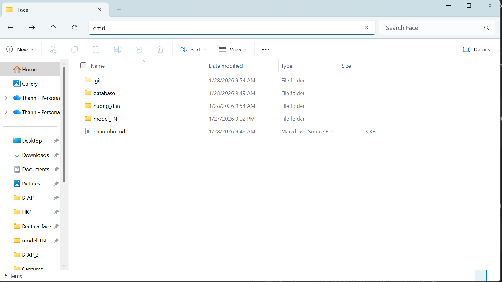
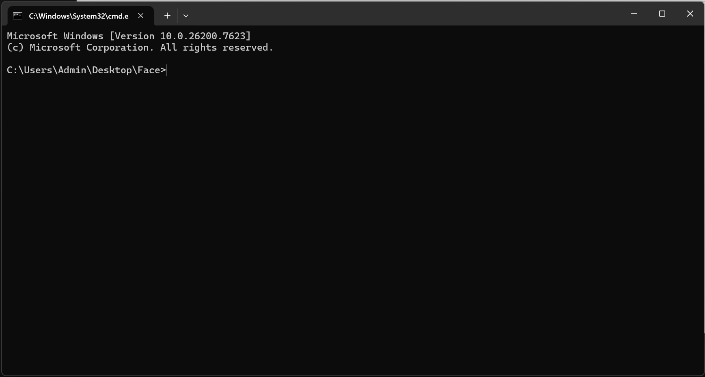

# Hướng Dẫn Git Workflow - Nhánh "face"

Tài liệu này hướng dẫn các thành viên (hoặc chính chủ) cách tải, cập nhật và đẩy mã nguồn trên nhánh phát triển tính năng nhận diện khuôn mặt (`face`).

---

## 1. Clone nhánh "face" về máy
Để chỉ tải duy nhất nhánh `face` về máy (giúp tiết kiệm dung lượng và tránh nhầm lẫn với nhánh `main`), hãy sử dụng lệnh sau trong Terminal/CMD:
<br>
Mở thư mục muốn clone về, gõ cmd trên thanh đường dẫn, sau đó enter

<hr>

```bash
git init
git remote add origin https://github.com/Ngocthuy3011/NCKH-Hard-To-Neglect.git
git branch -M face
git pull origin face
```
## 2. Quy trình làm việc (Cập nhật & Đẩy code)
### a. Cập nhật code mới nhất (Pull)
Luôn luôn thực hiện bước này trước khi bắt đầu viết code mới để tránh xung đột (conflict) với code cũ.

```Bash
# Kéo code mới nhất từ nhánh face trên server về máy
git pull origin face
```
### b. Lưu thay đổi (Add & Commit)
Sau khi đã code xong hoặc chỉnh sửa file, hãy lưu lại phiên bản đó:

```Bash
# 1. Thêm tất cả các file đã sửa vào danh sách chờ (Staging area)
git add .

# 2. Tạo commit kèm ghi chú rõ ràng (VD: cập nhật model, sửa lỗi camera...)
git commit -m "Thêm tính năng: [Mô tả ngắn gọn những gì bạn đã làm]"

# Đẩy code lên nhánh face
git push origin face
```
## 3. Xử lý sự cố thường gặp
### a. Lỗi: "Updates were rejected because the remote contains work that you do not have locally"
Nguyên nhân: Trên GitHub có code mới mà máy bạn chưa có.

Cách sửa: Bạn phải pull về trước, sau đó mới push lại được.

```Bash
git pull origin face
# (Nếu có conflict, hãy mở code ra sửa, sau đó git add . -> git commit lại)
git push origin face
```
### b. Kiểm tra trạng thái
Nếu không nhớ mình đã sửa những file nào, hãy dùng lệnh:

```Bash
git status
```


